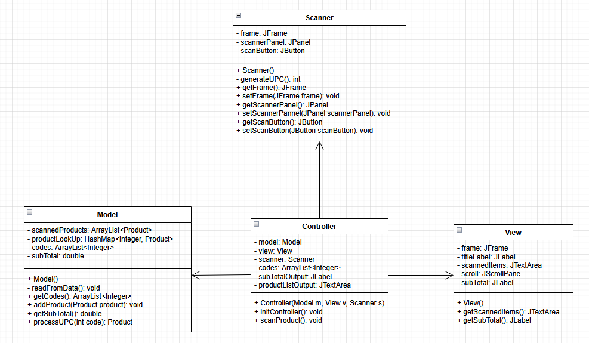

Example of an MVC design based on Swing. Answer questions 1 & 2 in this README file.

# Assignment 2
| Name | ID | Responsability   |
|---|---|------------------|
| William Lévesque | 100916180 | Q1 , Q2          |
| Saif Siddiqui | 100862747 | Code development |
| Tavan Mohammed | 100906916 | Sequence diagram                 |

## Q1
Swing is a GUI framework for Java, part of the Java Foundation Classes (JFC). It provides a wide range of cross-platform components that allow developers to effortlessly create modern and interactive desktop applications. It was designed to replace the old Abstract Window Toolkit (AWT), which was platform-dependent unlike swing. Swing, however is platform independent which was achieved through it being completely written in java. due to this, one can write Swing GUI applications and have them feel the same across many devices. Swing was also designed with MVC architecture in mind, giving developers fine control over the design and behaviour of their applications.

### Class Diagram
Here is a UML class diagram for the swing MVC components we created for the cash register. The model, view, and controller are included as well as the scanner since the controller receives scans from it. The relationships are simply association, with the controller at the center. The controller is the only one aware of the view, model, and scanner. 

## Q2
The github example swing program implements the MVC pattern well, but with some differences compared to what is in the lecture notes. To begin, the model does only hold buisness logic/data such as the first and last names and the getters/setters. The view contains no buisness logic/data and purely crates the user interface, minus the interaction logic. This does follow the MVC pattern. For the controller, it holds references to both the view and model to act as a mediator between the two. The controller initializes both, listens for events coming from the view and instructs the model on what to do. In this example, the view never gets updated.

This example implements the MVC differently in many ways. In the lecture, we cover ways of implementing this architecture using a type of observer pattern, meaning the view and model are observer and subject respectively. The main differences this creates is how information gets passed around. 

View - Controller: For both implementations, the view sends events from the user to the controller. However, in the github example, the view gets modified directly by the controller. This should not happen in the observer-pattern version.

Controller - Model: For both implementations, the controller calls the model's functions to complete tasks depending on what the user does. However, for the swing example, the controller also queries the model which should not happen in the observer version. 

Model - View: For the swing implementation, the view does not query the model ever, and the model never notifies views that something changed. This is core to the observer pattern version, since the view and model are the observer and subject.

Coupling: For the github example, the system is tightly coupled through the controller. The observer version makes this easier since the view and controller are more loosly coupled. Same with the view and model, since they work off the observer pattern. This also has the effect of making adding views an easier task, since they are not tightly coupled, and simply need to be added as observers to the model.

## Q3
Our code implementation follows a simple MVC model:

The cash register acts as the model that holds the basic business logic of a typical register, where it can calculate the total and store the scanned products. It can also read from the file to get product information and store it in a list that is used by the controller to randomly select a product.
The view is the user interface, which is created using the Swing framework and showcases the list of products, the subtotal, and the interface for the scanner button.
The controller is the middle point between the cash register and the view. It can utilize the cash register's methods to get product information and the subtotal once the scanner button is triggered, and manipulate the view to showcase the given data.

## Q4
Insert sequence diagram pic
